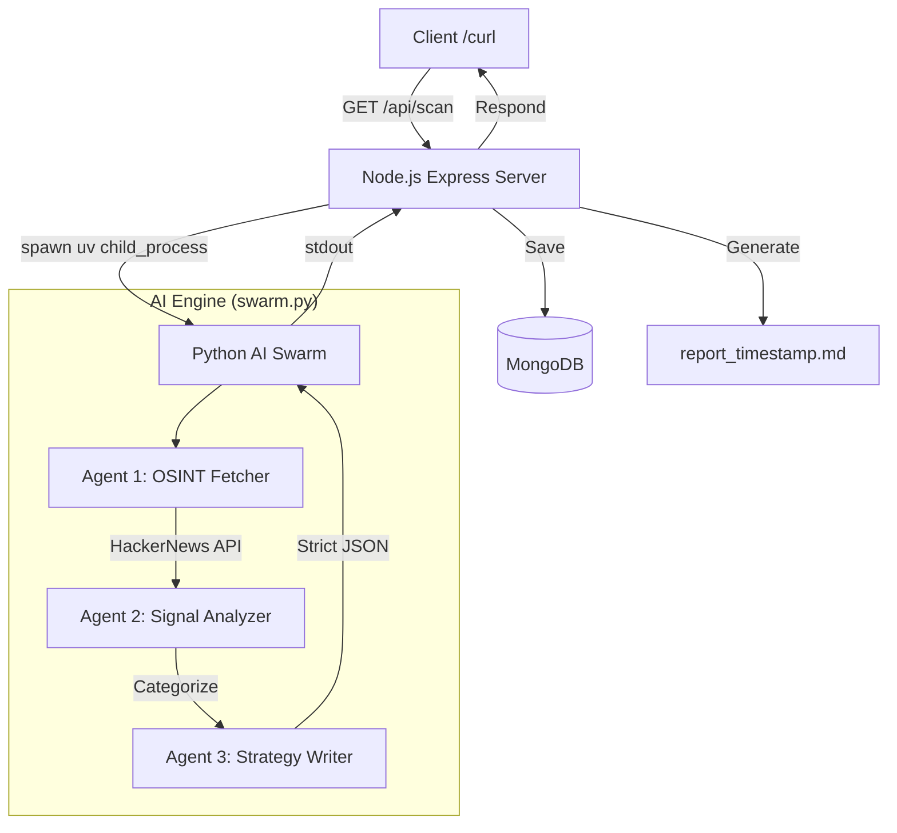

# 🛸 Competitor Intelligence Swarm

A powerful, autonomous hybrid AI system that monitors technology landscapes and generates strategic intelligence reports. Powered by **CrewAI**, **Groq (Llama 3.1)**, and **Node.js**.

---

## 🏗️ Architecture



## 🚀 Features

- **3-Agent AI Pipeline**: Specialized agents for fetching news, analyzing strategic signals, and writing structured reports.
- **Hybrid Architecture**: Combines the robustness of Node.js for API management with the flexibility of Python for AI workloads.
- **Real-time OSINT**: Automatically pulls the top 10 trending stories from the HackerNews API.
- **Strategic Categorization**: Classifies findings into **Threats**, **Opportunities**, and **Trends** with AI-driven rationales.
- **Dual Persistence**: Saves every scan to **MongoDB** and generates a standalone **Markdown report** for easy reading.
- **Ultra-Fast Inference**: Uses the Groq API with `llama-3.1-8b-instant` for near-instant intelligence gathering.

## 🛠️ Tech Stack

- **Backend**: Node.js, Express
- **AI Orchestration**: CrewAI (Python)
- **LLM**: Llama 3.1 8B (via Groq API)
- **Database**: MongoDB (Mongoose)
- **Package Management**: `uv` (Python), `npm` (Node)

## 📥 Installation

### 1. Prerequisites
- [Node.js](https://nodejs.org/)
- [UV](https://github.com/astral-sh/uv) (Python package manager)
- [MongoDB](https://www.mongodb.com/docs/manual/installation/) running locally

### 2. Clone and Setup
```bash
# Install Node dependencies
npm install

# Setup Python environment using UV
uv venv .venv
source .venv/bin/activate
uv pip install -r requirements.txt
uv pip install litellm
```

### 3. Environment Variables
Create a `.env` file in the root directory:
```env
GROQ_API_KEY=your_groq_api_key_here
MONGO_URI=mongodb://localhost:27017/competitor_intelligence
```

---

## 🚦 Usage

### 1. Start the Server
```bash
# Ensure MongoDB is running first
brew services start mongodb-community

# Start the Express server
node server.js
```

### 2. Trigger a Scan
In a separate terminal, hit the scan endpoint:
```bash
curl http://localhost:3000/api/scan
```

### 3. View Results
- **API Response**: You will receive a JSON object of the intelligence report.
- **Markdown File**: A new file named `report_[timestamp].md` will be created in the project root.
- **Database**: The report is saved to the `intelligences` collection in your MongoDB.

---

## 📡 API Reference

| Endpoint | Method | Description |
| :--- | :--- | :--- |
| `/api/scan` | `GET` | Triggers the AI swarm and returns the generated report. |
| `/api/reports` | `GET` | Returns a list of all historical reports from MongoDB. |
| `/api/reports/:id` | `GET` | Returns a specific report by its ID. |

---

## 📄 License
MIT
